# Oralable mobile apps — flows, screens, and roadmap

Canonical UX/navigation reference for **Oralable** (consumer) and **Oralable for Dentists** (professional).  
There are **no Figma/Sketch wireframes** in the repos; this document plus **implemented SwiftUI** are the source of truth.

**Related:** [LAUNCH_READINESS_CHECKLIST.md](../OralableApp/LAUNCH_READINESS_CHECKLIST.md) · [oralable_nrf/docs/ORALABLE_MARKET_LANDSCAPE.md](../../oralable_nrf/docs/ORALABLE_MARKET_LANDSCAPE.md) §5 · [cursor_oralable/docs/PRODUCT_ROADMAP.md](../../cursor_oralable/docs/PRODUCT_ROADMAP.md) · [cursor_oralable/docs/IP_NORTH_STAR.md](../../cursor_oralable/docs/IP_NORTH_STAR.md) · [cursor_oralable/docs/data_room/COST_AND_TIMELINE.md](../../cursor_oralable/docs/data_room/COST_AND_TIMELINE.md) · [cursor_oralable/docs/ALGORITHM_ARCHITECTURE.md](../../cursor_oralable/docs/ALGORITHM_ARCHITECTURE.md) · **Figures:** [FIGURES.md](./FIGURES.md) · master [cursor_oralable/docs/FIGURES.md](../../cursor_oralable/docs/FIGURES.md)

**Last updated:** 31 Jul 2026 · **Doc version:** 1.2.3 · FW **1.0.70** · app **4.3.3** · timeline → PRODUCT_ROADMAP §3

**Phase note (July 2026):** **Phase 0 Vitals** is the shipping UX — temple HR/SpO₂, placement picker, no muscle-fit calibration. Fit guide + `CalibrationWizardView` below are **Phase 1+ / legacy** paths (feature-flagged). Hardware: Gen1 · BOM REV8 · PCB REV10 · ES2832AA2 · FW **1.0.70** · app **4.3.3** (STAT blink = dock/charge; Automatic OK).

**Ed/Pedro:** ship **Oralable (patient) only**. Keep **Oralable for Dentists** and `showCloudKitShare` dark until Phase 1+ — see `cursor_oralable/docs/data_room/APPS_AND_REVENUE_EVAL.md`.

**Strategy:** Stage A wellness wearable → Stage B medical (later) · new US patent embodiment. Planning costs/timeline: `COST_AND_TIMELINE.md`.

---

## Table of contents

1. [Apps and bundles](#1-apps-and-bundles)
2. [How the patient app works — Phase 0](#2-how-the-patient-app-works--phase-0)
3. [Consumer app — launch and navigation](#3-consumer-app--launch-and-navigation)
4. [Consumer app — screen inventory](#4-consumer-app--screen-inventory)
5. [Professional app — navigation](#5-professional-app--navigation)
6. [Professional app — screen inventory](#6-professional-app--screen-inventory)
7. [Patient → dentist data flow](#7-patient--dentist-data-flow)
8. [BLE → UI data path](#8-ble--ui-data-path)
9. [Pre-launch UI (feature flags)](#9-pre-launch-ui-feature-flags)
10. [Done vs remaining](#10-done-vs-remaining)
11. [Roadmap and timeline](#11-roadmap-and-timeline)
12. [Source files (navigation)](#12-source-files-navigation)

---

## 1. Apps and bundles

| App | Target | Bundle ID | Entry point |
|-----|--------|-----------|-------------|
| **Oralable** | Patient / consumer | `com.jacdental.oralable` | `OralableApp/Oralable.swift` → `LaunchCoordinator` |
| **Oralable for Dentists** | Clinician / practice | `com.jacdental.oralable.dentist` | `OralableForProfessionals/OralableForProfessionals.swift` → `ProfessionalRootView` |

Shared: **OralableCore** (BLE parsing, algorithms, design tokens, `AutomaticRecordingSession`, CloudKit handshake export).

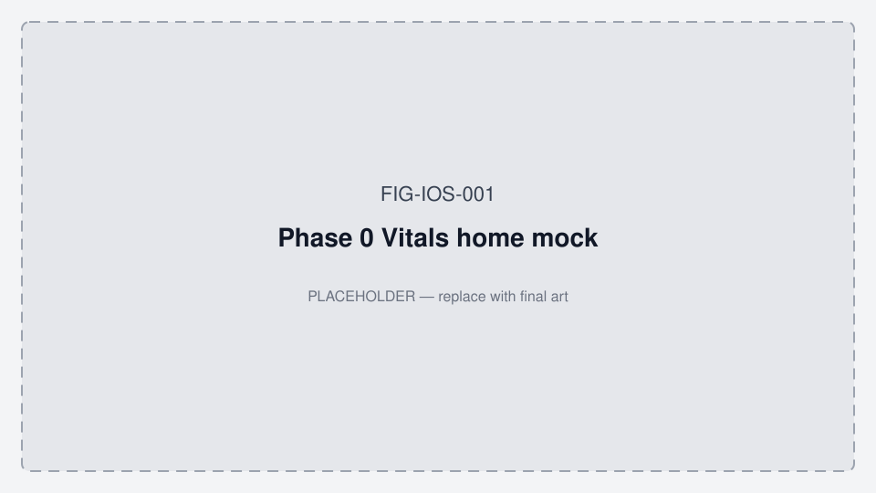

*Figure FIG-IOS-001 — Phase 0 Vitals home mock (placeholder).*

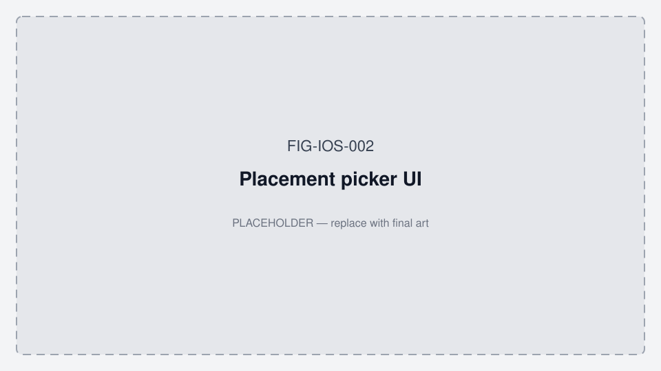

*Figure FIG-IOS-002 — Placement picker UI (placeholder).*

---

## 2. How the patient app works — Phase 0

End-to-end working model for **Oralable 4.3.3** + FW **1.0.70** (Ed/Pedro kits). Wellness wording only — not a medical diagnosis.

### 2.1 Night / day session lifecycle

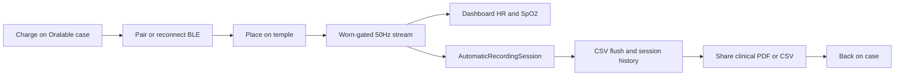

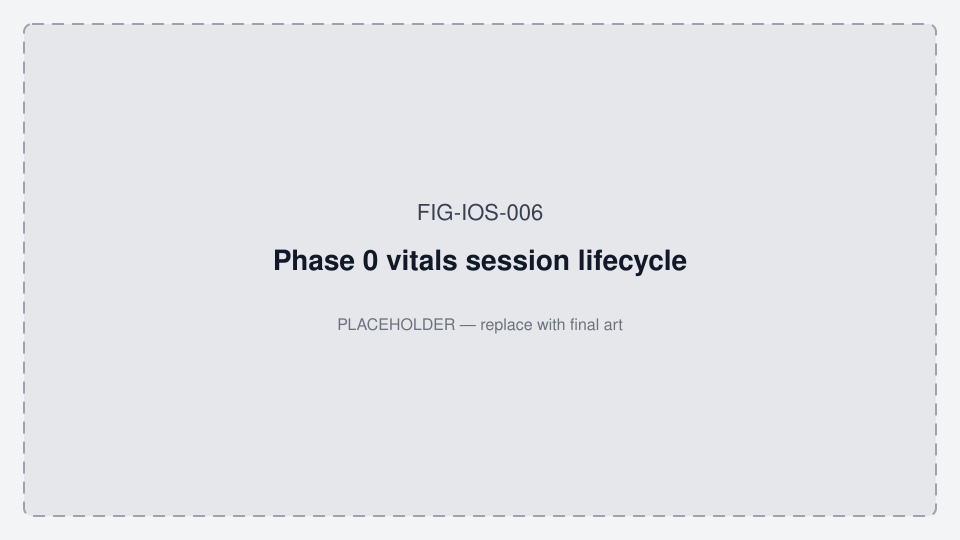

*Figure FIG-IOS-006 — Phase 0 vitals session lifecycle (placeholder).*

| Step | What the user does | What the app does |
|------|--------------------|-------------------|
| Charge | Clip on Oralable magnetic case (USB-C) | Status LED mirror: blink = charging; solid = taper; `on_dock` / `charge_active` |
| Pair | Open Devices / first-launch discovery | Scan TGM `3A0FF000` → FW gate (≥1.0.63, recommend 1.0.70) → CCC enable |
| Place | Temple (default) | Placement picker: Manual or Automatic (STAT); quality-gated vitals |
| Wear night | Leave app background-capable | Auto-record; pause on disconnect; resume on reconnect |
| Morning | Share / history | Clinical Temporalis PDF + event CSV when samples exist |

### 2.2 Main tab map (what each tab is for)

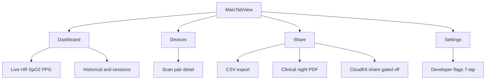

### 2.3 Placement and device state (Phase 0)

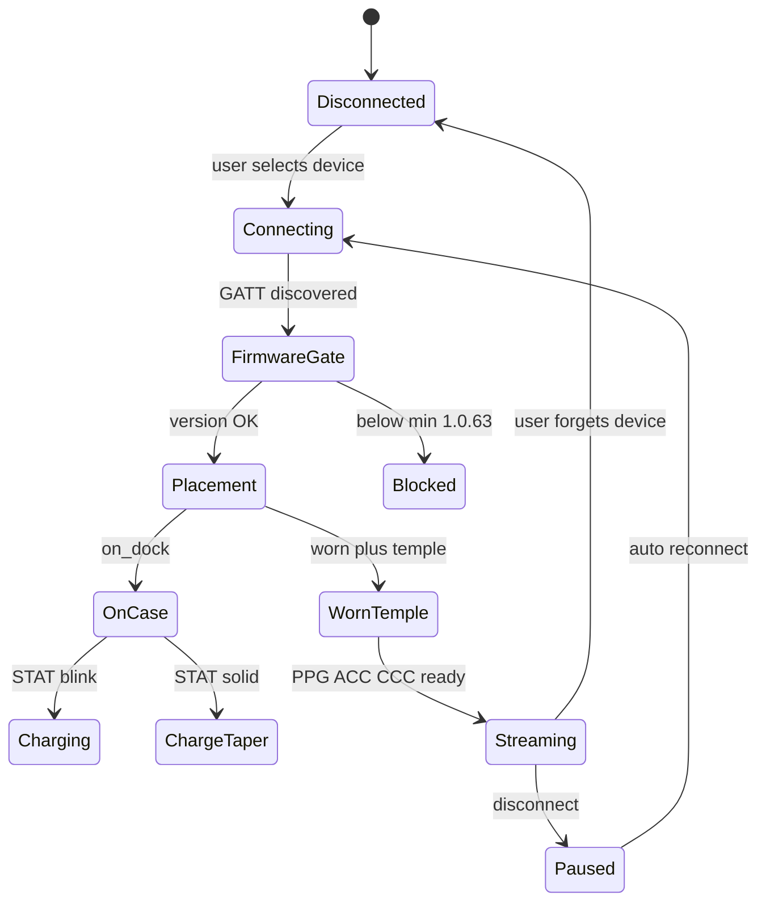

**UI surfaces:** `VitalsDeviceStatusCard` · `DeviceStatusLEDView` · placement picker · worn indicator.

### 2.4 Automatic recording (no Start button)

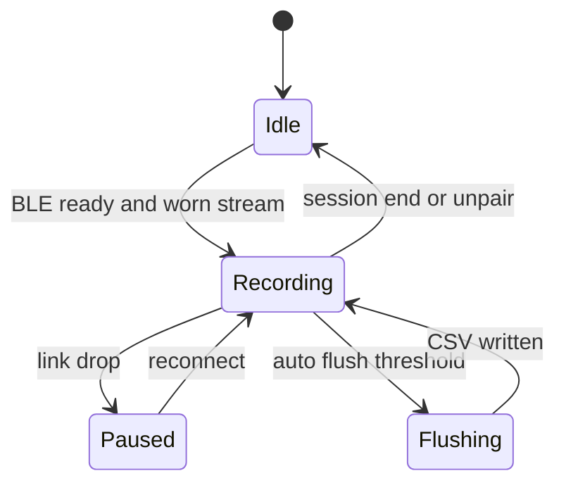

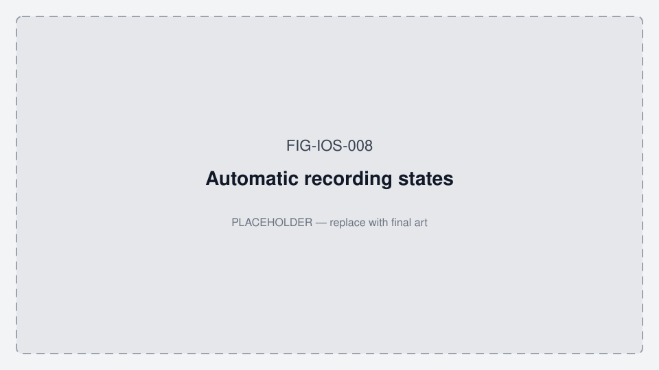

*Figure FIG-IOS-008 — Automatic recording states (placeholder).*

Recording is owned by `AutomaticRecordingSession` (OralableCore). Dashboard shows streaming / positioned / activity via `RecordingStateIndicator` — not a manual start/stop control.

### 2.5 Live data → numbers on screen

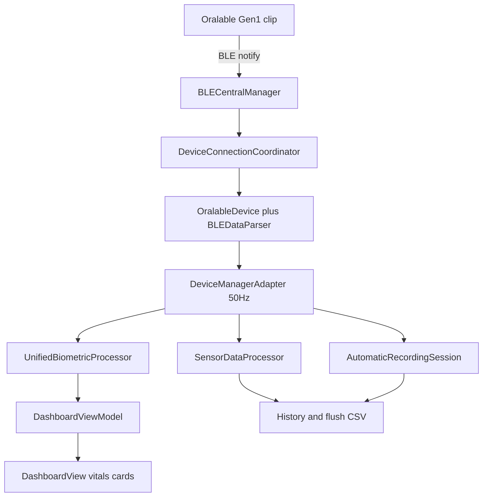

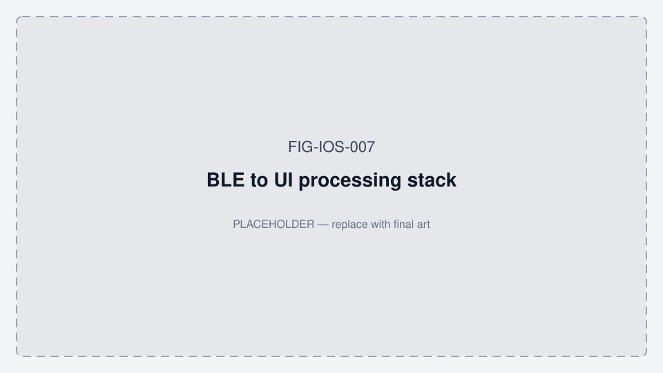

*Figure FIG-IOS-007 — BLE to UI processing stack (placeholder).*

Detail (CCC order, readiness): [§8 BLE → UI data path](#8-ble--ui-data-path).

---

## 3. Consumer app — launch and navigation

**Controller:** `OralableApp/Views/LaunchCoordinator.swift`

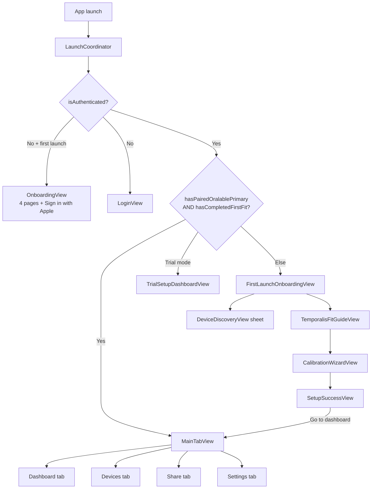

### First-launch setup sequence

**Phase 0 (current):** pair → placement (temple / case / bench) → vitals dashboard. Calibration wizard is **not** required.

| Step | Screen | Purpose |
|------|--------|---------|
| 1 | `FirstLaunchOnboardingView` | Explain pair → place on temple → vitals |
| 2 | `DeviceDiscoveryView` | Scan/connect Oralable Gen1 REV10 (TGM `3A0FF000`) |
| 3 | Placement picker / Vitals device status | Manual or Automatic (FW ≥ 1.0.70 STAT); Charge/Taper chips |
| 4 | Dashboard | HR / SpO₂ with quality gating |

**Phase 1+ / legacy (muscle path — deferred):**

| Step | Screen | Purpose |
|------|--------|---------|
| 3′ | `TemporalisFitGuideView` | Mirror camera + placement on temporalis peak |
| 4′ | `CalibrationWizardView` | IR-DC baseline / coupling check |
| 5′ | `SetupSuccessView` | Confirm; **only here** → `markFirstFitCompleted()` → `MainTabView` |

**Trial path:** User can skip pairing → `TrialSetupDashboardView` (limited dashboard without full gold-standard setup).

**Auto-resume:** If `sessionHistoryStore.temporalisSleepCalibration` exists on launch, pairing + first-fit flags can be restored (`LaunchCoordinator.onAppear`).

### Main tabs (`MainTabView.swift`)

| Tab | Root view | Notes |
|-----|-----------|-------|
| Dashboard | `HomeView` → `DashboardView` **or** `SimplifiedDashboardView` | Toggle via Settings → `useSimplifiedDashboard` (`@AppStorage`) |
| Devices | `DevicesView` | BLE scan, paired devices, `DeviceDetailView` |
| Share | `ShareView` | Export CSV, share with professional (when enabled) |
| Settings | `SettingsView` | Health, support links, hidden developer settings (7-tap version) |

### Dashboard drill-down

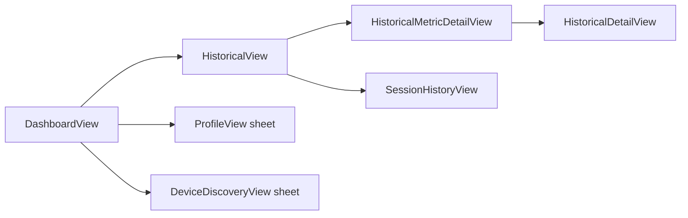

**Recording:** Automatic on BLE connect (`AutomaticRecordingSession`); no manual start/stop on dashboard. State indicator: streaming / positioned / activity (`RecordingStateIndicator`).

---

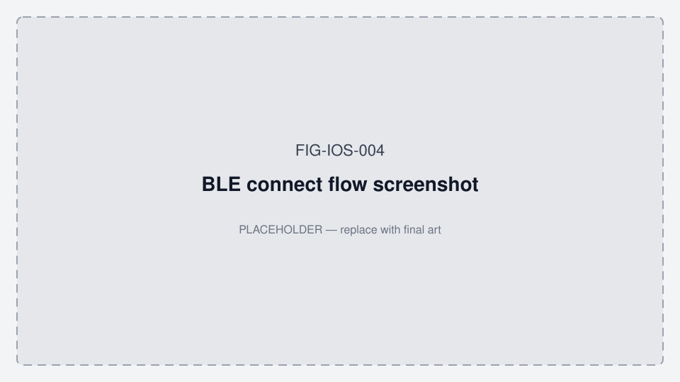

*Figure FIG-IOS-004 — BLE connect flow screenshot (placeholder).*

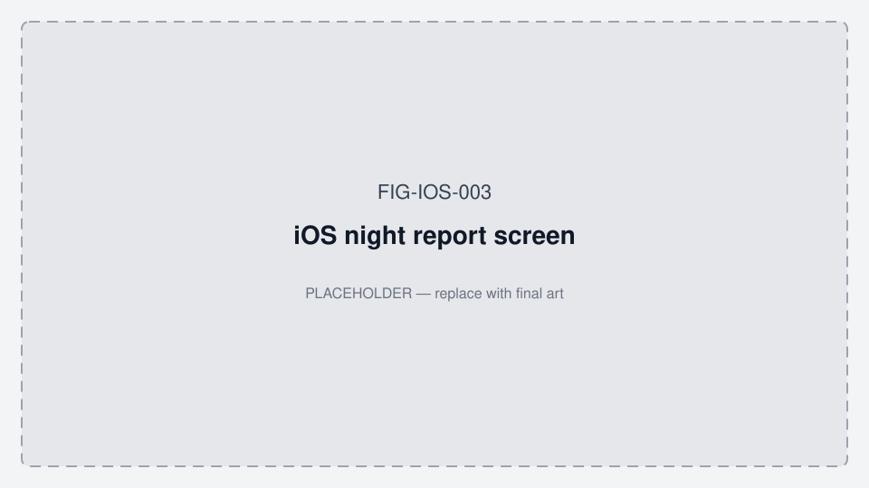

*Figure FIG-IOS-003 — iOS night report / hypnogram (adapts [FIG-CO-025](../../cursor_oralable/docs/figures/FIG-CO-025-state-hypnogram-exemplar.png); `StateHypnogramView`).*

## 4. Consumer app — screen inventory

| Screen | File | Status | Notes |
|--------|------|--------|-------|
| Launch coordinator | `LaunchCoordinator.swift` | ✅ Shipped | Single gate for auth + setup |
| Welcome onboarding | `OnboardingView.swift` | ✅ | 4 pages, Sign in with Apple, skip |
| Login | `LoginView.swift` | ✅ | Returning users |
| First-launch setup | `FirstLaunchOnboardingView.swift` | ✅ | Pair + fit entry |
| Trial dashboard | `TrialSetupDashboardView.swift` | ✅ | Skipped pairing |
| Main tabs | `MainTabView.swift` | ✅ | 4 tabs |
| Dashboard (full) | `DashboardView.swift` | ✅ | PPG IR always; optional cards behind flags |
| Dashboard (simplified) | `SimplifiedDashboardView.swift` | ✅ | Reduced layout |
| Apple Health summary strip | `DashboardView` (`showAppleHealthSummary`) | ✅ | TFI + SASHB cards when clinical metrics on |
| Devices list | `DevicesView.swift` | ✅ | |
| Device discovery | `DeviceDiscoveryView.swift` | ✅ | Scan + pair |
| Device detail | `DeviceDetailView.swift` | ✅ | |
| Share / export | `ShareView.swift` | ✅ | CSV paths; CloudKit share gated |
| Professional share section | `ProfessionalShareView.swift`, share components | ✅ | Behind `showCloudKitShare` |
| Settings | `SettingsView.swift` | ✅ | |
| Subscription | `SubscriptionSettingsView.swift` | ✅ | Behind `showSubscription` |
| Thresholds / events | `ThresholdsSettingsView.swift`, `EventSettingsView.swift` | ✅ | Behind flags |
| Developer settings | `DeveloperSettingsView.swift` | ✅ | Feature flags, demo mode, FW tools |
| Historical overview | `HistoricalView.swift` | ✅ | Charts, date navigation |
| Historical detail | `HistoricalDetailView.swift` | ⚠️ Partial | PDF + HealthKit export stubs |
| Session history | `SessionHistoryView.swift` | ✅ | |
| Temporalis fit guide | `TemporalisFitGuideView.swift` | ✅ | Mirror + calibration flow |
| Calibration | `CalibrationWizardView.swift`, `CalibrationView.swift` | ✅ | |
| Setup success | `SetupSuccessView.swift` | ✅ | Gates main app |
| Profile | `ProfileView.swift` | ✅ | |
| Logs / debug | `LogsView.swift`, `DebugMenuView.swift` | ✅ Dev | |
| Worn status | `WornStatusView.swift` | ✅ | Off-body indicator |
| Subscription tier picker | `SubscriptionTierSelectionView.swift` | ✅ | |

**Component library:** `OralableApp/Components/`, `DesignSystem.swift`, `OralableCore/DesignSystem/`.

---

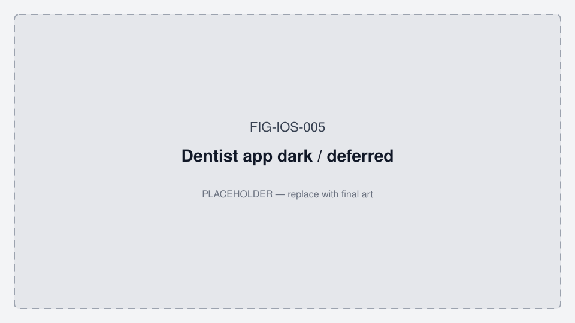

*Figure FIG-IOS-005 — Dentist app dark / deferred (placeholder; Phase 1+).*

## 5. Professional app — navigation

**Controller:** `ProfessionalRootView` in `OralableForProfessionals.swift`

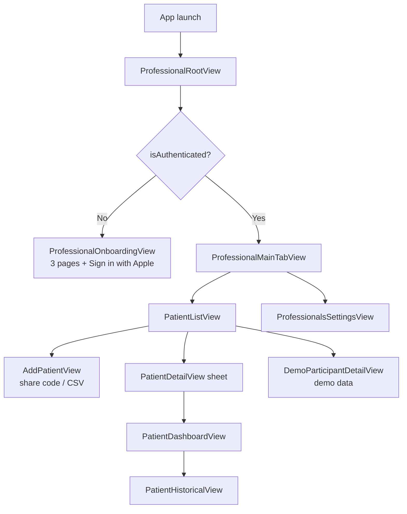

---

## 6. Professional app — screen inventory

| Screen | File | Status | Notes |
|--------|------|--------|-------|
| Professional onboarding | `OralableForProfessionals.swift` | ✅ | 3 pages + Sign in |
| Participant list | `PatientListView.swift` | ✅ | Search, empty state, upgrade banner |
| Add participant | `AddPatientView.swift` | ✅ | 6-digit share code + CSV import |
| Participant detail | `PatientDetailView.swift` | ✅ | Wraps dashboard |
| Participant dashboard | `PatientDashboardView.swift` | ✅ | TFI / session summary |
| Participant historical | `PatientHistoricalView.swift` | ✅ | Multi-session charts |
| Demo participant | `DemoParticipantDetailView.swift` | ✅ | `DemoDataManager` |
| Settings | `ProfessionalsSettingsView.swift` | ✅ | |
| Upgrade prompt | `UpgradePromptView.swift` | ✅ | Starter tier limits |
| Developer settings | `DeveloperSettingsView.swift` | ✅ | |

---

## 7. Patient → dentist data flow

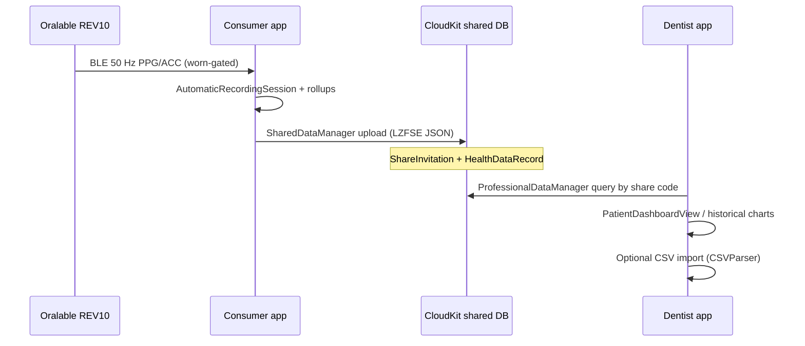

**Handshake export:** `OralableCore` `ProfessionalHandshakeExport` — hourly TFI / SASHB for clinician review.

**Launch blocker:** Production CloudKit schema not deployed — see [CLOUDKIT_PRODUCTION_SETUP.md](../OralableApp/CLOUDKIT_PRODUCTION_SETUP.md).

---

## 8. BLE → UI data path

Technical flow (not screen flow). See also `cursor_oralable/docs/upload/02_IOS_BLE_STREAMING_SUMMARY.txt` and [§2.5](#25-live-data--numbers-on-screen).

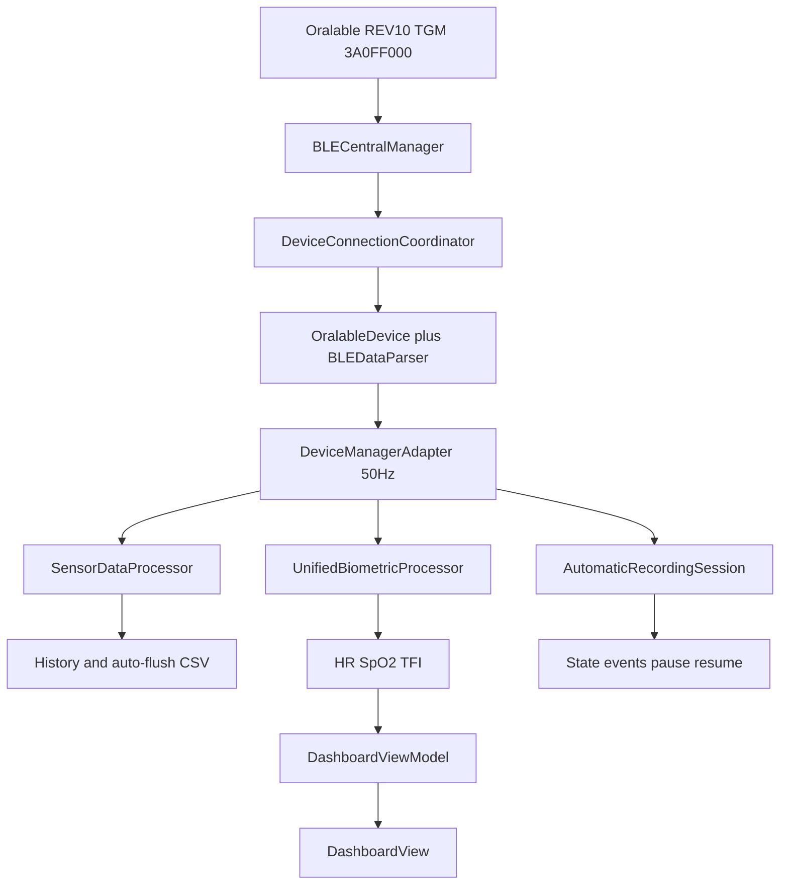

**Connect readiness:**


Ready when PPG + ACC + **status + battery** CCC confirms are set (`OralableDevice.NotificationReadiness.allRequired`).

**CCC order (await each `didUpdateNotificationState`):** battery `004` → status `009` → PPG `001` → ACC `002` → temp `003`. Battery CCC and streaming CCC blocks use **timeouts**; on failure the coordinator calls `cancelPendingContinuations()` so waiters do not hang. Disable/`isNotifying == false` also resumes waiters with error.

---

## 9. Pre-launch UI (feature flags)

`FeatureFlags.swift` — toggles in **Developer Settings** (tap app version 7× in Settings).

| Flag | Default (pre-launch) | UI affected |
|------|----------------------|-------------|
| `showHeartRateCard` | **false** | Dashboard HR card |
| `showSpO2Card` | **false** | Dashboard SpO₂ card |
| `showMovementCard` | **false** | Movement / ACC card |
| `showTemperatureCard` | **false** | Temperature card |
| `showBatteryCard` | **false** | Battery card |
| `showEMGCard` | **false** | EMG card (ANR path) |
| `showSubscription` | **false** | Settings subscription section |
| `showCloudKitShare` | **false** | Share with professional |
| `showDetectionSettings` | **false** | Thresholds / event settings |
| `showPilotStudy` | **false** | Pilot UI |
| `showOvernightHypnogram` | **true** (vitals) / **false** (App Store Minimal) | Dashboard morning card + Share hypnogram preview (FIG-CO-025 adaptation) |
| PPG IR card | **always on** | Core dashboard waveform |

**App Store screenshots** should reflect **flag-off** consumer UI unless you intentionally launch with flags lifted.

### Firmware diagnostics (Developer Settings, FW ≥ 1.0.37)

Hidden: Settings → About → tap version **7×** → **Developer Settings**.

| Action | BLE | Purpose |
|--------|-----|---------|
| Auto on connect | Notify `3A0FF00A` | Firmware log lines → app log + nRF CSV export |
| **Dump firmware diagnostics** | Write `3A0FF00B` opcode `0x07`, read `3A0FF00C` | Snapshot charging/worn/battery + config state |
| **Apply firmware settings** | Write `3A0FF00B` TLV | LED PA, intervals, stream mask (bench) |
| **Export nRF-style CSV** | — | Full session log for side-by-side with nRF Connect |

iOS `FirmwareGate` minimum **1.0.63** (hard gate). Recommend **1.0.70** (`recommendedOralableSemanticVersion`) for Automatic dock via LTC4124 STAT blink/taper. Older than **1.0.70** still connect with manual placement. Bench matrix: [ORALABLE_SYSTEM_ARCHITECTURE.md](../../cursor_oralable/docs/ORALABLE_SYSTEM_ARCHITECTURE.md#3-validation-status-matrix-where-we-are).

---

## 10. Done vs remaining

### ✅ Implemented (code-complete)

- Dual-app architecture + OralableCore
- Full launch graph (auth → onboarding → setup → tabs)
- Real-time dashboard + historical charts + session history
- Automatic recording with disconnect pause/resume
- BLE nRF Connect–aligned connect (FW ≥ 1.0.36 gate; awaited CCC; fw-log `00A`–`00C` when FW ≥ 1.0.37)
- **Vitals phase:** `VitalsDeviceStatusCard` + **Device LED mirror** (`DeviceStatusLEDView` / OralableCore `statusLED()`)
- Share/export CSV paths, clinical PDF generator (server-side path in app)
- StoreKit 2 code (6 IAP products)
- Design system + asset colors (both apps)
- UI tests: `OnboardingUITests`, `NavigationTests`, `NRFConnectCompatibilityTests`
- Demo data path for dentist app

### ⏳ Launch blockers (infra, not UI code)

| Item | Doc |
|------|-----|
| CloudKit production schema | `CLOUDKIT_PRODUCTION_SETUP.md` |
| App Store Connect IAP live | `APP_STORE_CONNECT_IAP_SETUP.md` |
| Metadata + screenshots + submission | `APP_STORE_METADATA.md`, `DENTIST_APP_STORE_METADATA.md` |

### ✅ Shipped (export + in-app hypnogram)

| Item | Spec reference | Notes |
|------|----------------|-------|
| **Overnight clinical PDF** | [OVERNIGHT_NIGHT_REPORT.md](../../cursor_oralable/docs/OVERNIGHT_NIGHT_REPORT.md) · FTS APP-10 | Share → Clinical Temporalis Report — hypnogram-first, hourly stack, dual-rail, event CSV |
| **In-app state hypnogram** | OVERNIGHT · FIG-CO-025 · APP-10 | `StateHypnogramView` + `OvernightMorningCardView` + `OvernightNightReportBuilder`; Share preview + Dashboard; flag `showOvernightHypnogram` |

### 🔲 Product UX not designed or built

| Item | Spec reference | Notes |
|------|----------------|-------|
| **Wireframes / screen map (visual)** | — | **This doc §2 Mermaid + FIG-IOS-*** replaces until Figma exists |
| **Overnight morning card polish** | OVERNIGHT_NIGHT_REPORT · APP-10 | Core UI shipping; Figma / screenshot art for FIG-IOS-003 still open |
| **App Store screenshot designs** | Launch checklist | 7 per app — copy exists, art not in repo |
| PDF export from `HistoricalDetailView` | Launch checklist known issues | Stub at line ~73 |
| HealthKit export from historical | Launch checklist | Stub |
| Dentist onboarding guide (PDF/web) | Launch checklist post-launch | |
| Android app | Landscape §10 | Native Kotlin MVP, 2026 H2 target |
| In-app firmware OTA | Landscape §12 | Use Nordic Device Manager for now |
| iPad / Watch / widgets | Launch checklist post-launch | |

---

## 11. Roadmap and timeline

Aligns with [PRODUCT_ROADMAP.md](../../cursor_oralable/docs/PRODUCT_ROADMAP.md), [IP_NORTH_STAR.md](../../cursor_oralable/docs/IP_NORTH_STAR.md), [COST_AND_TIMELINE.md](../../cursor_oralable/docs/data_room/COST_AND_TIMELINE.md), [LAUNCH_READINESS_CHECKLIST.md](../OralableApp/LAUNCH_READINESS_CHECKLIST.md), and [ORALABLE_MARKET_LANDSCAPE.md](../../oralable_nrf/docs/ORALABLE_MARKET_LANDSCAPE.md) §12.

| Phase | Target | Hardware | Deliverables |
|-------|--------|----------|--------------|
| **Phase 0 — Vitals** | Now – Sep 2026 | Gen1 BOM REV8 / REV10 / FW **1.0.70** · app **4.3.3** | Temple HR/SpO₂; placement + STAT LED mirror; kits **gated**; patient app only |
| **Eng overnight PDF** | **Shipped 24 Jul 2026** | Same Gen1 | Share clinical PDF + Mac night pack (hypnogram-first) — early eng, not Phase 1+ complete |
| **Phase 1+ — Muscle** | Q4 2026 – Q1 2027 | **Same Gen1** hardware | IR-DC / TFI / SASHB live UX; Protocol B; ≥6 h overnight eval; morning card polish (hypnogram UI already shipping) |
| **Gen2 hardware** | Q4 2026 – H2 2027 | BOM REV9 / REV11 / ES4L15BA1 / FW 2.0.x | Same GATT; longer battery; chrsts/SOC/LED targets |
| **P4 — Android MVP** | Q3–Q4 2026+ | Gen1 stream | Kotlin BLE + local CSV |
| **P5 — Regulated UI** | H2 2027 – 2028 | Gen2 primary | SaMD-locked labeling, 510(k) monitoring claims |

Canonical calendar: [PRODUCT_ROADMAP.md §3](../../cursor_oralable/docs/PRODUCT_ROADMAP.md#3-timeline-calendar--canonical).

### Unified overnight report (status)

**Canonical direction:** [`OVERNIGHT_NIGHT_REPORT.md`](../../cursor_oralable/docs/OVERNIGHT_NIGHT_REPORT.md)

- **Evaluable overnight:** **≥ 6 hours** worn (goal **8 h**). Under 6 h → Insufficient data (no bands).
- **Scoring:** blood-pressure-style **Low / Moderate / High** on TFI, SASHB/h, rescue/h, tonic min/h — **not** sleep-score-first; cohort percentiles later; personal trends first.
- **Primary graphic:** **state hypnogram** (most useful overnight view). Hourly stack and dual-rail support dentist detail; 3D is appendix.

**Shipped (Share PDF):** `ClinicalReportGenerator` + `OvernightStateClassifier` + `NightReportSampleLoader`  
Pages: KPIs → **bout hypnogram (lead)** → hourly stack + SASHB → smoking-gun IR-DC/SpO₂ → event table; plus `Oralable_Night_Events_*.csv`.  
Samples from `sensorDataHistory` + memory-flush CSVs + session `dataFilePath`.

**In-app (shipping):** morning card + Share preview with **band chips + state hypnogram** (adapts FIG-CO-025):

```
┌─────────────────────────────────────────┐
│  Night · ≥6h · Jaw load | O2 | Rescue   │  ← Low / Moderate / High chips
├─────────────────────────────────────────┤
│  State hypnogram (primary)              │  ← StateHypnogramView
├─────────────────────────────────────────┤
│  [Share PDF] (hourly / dual-rail in PDF)│
└─────────────────────────────────────────┘
```

Consumer: Dashboard + Share hypnogram; full hourly/dual-rail in Clinical PDF.  
Dentist: same bands + hypnogram language later; handshake hourly rollups.

**Feature flag:** `showOvernightHypnogram` — Developer Settings → Overnight Hypnogram.

---

## 12. Source files (navigation)

| Concern | Path |
|---------|------|
| Consumer launch flow | `OralableApp/Views/LaunchCoordinator.swift` |
| Consumer tabs | `OralableApp/Views/MainTabView.swift` |
| First-launch state | `OralableApp/Managers/FirstLaunchManager.swift` |
| Professional root | `OralableForProfessionals/OralableForProfessionals.swift` |
| Feature flags | `OralableApp/Managers/FeatureFlags.swift` |
| CloudKit share | `OralableApp/Managers/SharedDataManager.swift` |
| Pro data ingest | `OralableForProfessionals/Managers/ProfessionalDataManager.swift` |
| Design tokens | `OralableCore/Sources/OralableCore/DesignSystem/` |

---

*Maintainers: update this file when adding a new root navigation path or shipping a major UX phase. Bump version in footer when structure changes.*
