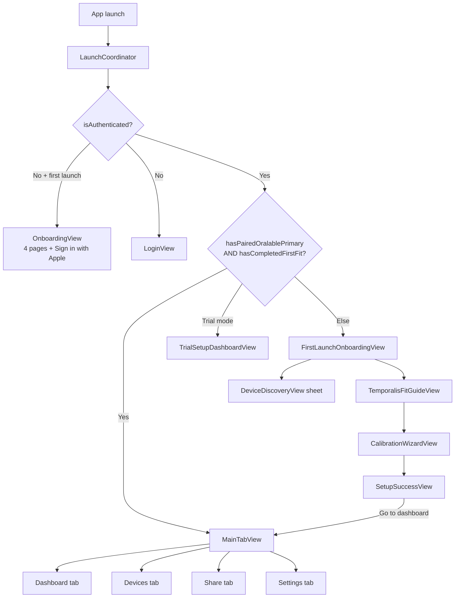
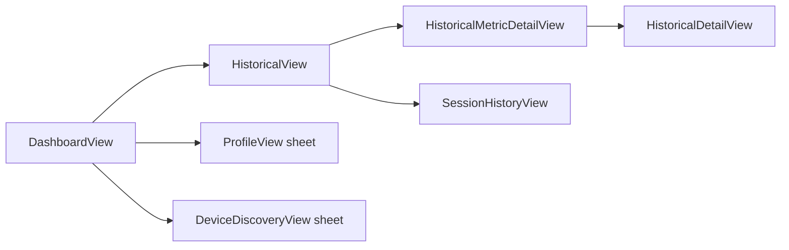
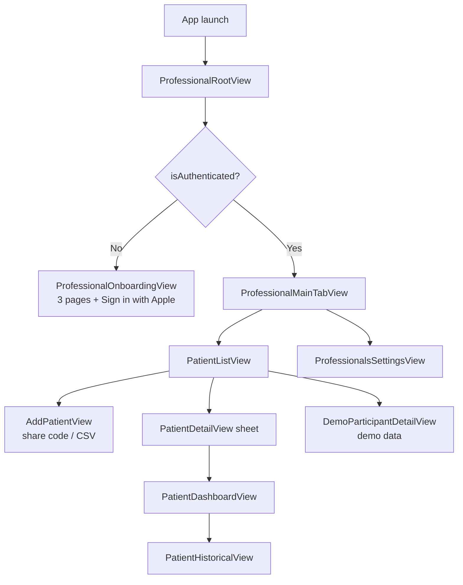
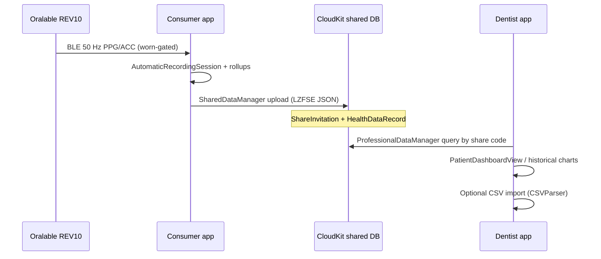

# Oralable mobile apps — flows, screens, and roadmap

Canonical UX/navigation reference for **Oralable** (consumer) and **Oralable for Dentists** (professional).  
There are **no Figma/Sketch wireframes** in the repos; this document plus **implemented SwiftUI** are the source of truth.

**Related:** [LAUNCH_READINESS_CHECKLIST.md](../OralableApp/LAUNCH_READINESS_CHECKLIST.md) · [oralable_nrf/docs/ORALABLE_MARKET_LANDSCAPE.md](../../oralable_nrf/docs/ORALABLE_MARKET_LANDSCAPE.md) §5 · [cursor_oralable/docs/ALGORITHM_ARCHITECTURE.md](../../cursor_oralable/docs/ALGORITHM_ARCHITECTURE.md) · BLE stack summary in `cursor_oralable/docs/upload/02_IOS_BLE_STREAMING_SUMMARY.txt`

**Last updated:** June 2026 · **Doc version:** 1.0.0

---

## Table of contents

1. [Apps and bundles](#1-apps-and-bundles)
2. [Consumer app — launch and navigation](#2-consumer-app--launch-and-navigation)
3. [Consumer app — screen inventory](#3-consumer-app--screen-inventory)
4. [Professional app — navigation](#4-professional-app--navigation)
5. [Professional app — screen inventory](#5-professional-app--screen-inventory)
6. [Patient → dentist data flow](#6-patient--dentist-data-flow)
7. [BLE → UI data path](#7-ble--ui-data-path)
8. [Pre-launch UI (feature flags)](#8-pre-launch-ui-feature-flags)
9. [Done vs remaining](#9-done-vs-remaining)
10. [Roadmap and timeline](#10-roadmap-and-timeline)
11. [Source files (navigation)](#11-source-files-navigation)

---

## 1. Apps and bundles

| App | Target | Bundle ID | Entry point |
|-----|--------|-----------|-------------|
| **Oralable** | Patient / consumer | `com.jacdental.oralable` | `OralableApp/Oralable.swift` → `LaunchCoordinator` |
| **Oralable for Dentists** | Clinician / practice | `com.jacdental.oralable.dentist` | `OralableForProfessionals/OralableForProfessionals.swift` → `ProfessionalRootView` |

Shared: **OralableCore** (BLE parsing, algorithms, design tokens, `AutomaticRecordingSession`, CloudKit handshake export).

---

## 2. Consumer app — launch and navigation

**Controller:** `OralableApp/Views/LaunchCoordinator.swift`



### First-launch setup sequence

| Step | Screen | Purpose |
|------|--------|---------|
| 1 | `FirstLaunchOnboardingView` | Explain pair → fit → calibrate |
| 2 | `DeviceDiscoveryView` | Scan/connect Oralable REV10 (TGM `3A0FF000`) |
| 3 | `TemporalisFitGuideView` | Mirror camera + placement on temporalis peak |
| 4 | `CalibrationWizardView` | IR-DC baseline / coupling check |
| 5 | `SetupSuccessView` | Confirm; **only here** → `markFirstFitCompleted()` → `MainTabView` |

**Trial path:** User can skip pairing → `TrialSetupDashboardView` (limited dashboard without full gold-standard setup).

**Auto-resume:** If `sessionHistoryStore.temporalisSleepCalibration` exists on launch, pairing + first-fit flags can be restored (`LaunchCoordinator.onAppear`).

### Main tabs (`MainTabView.swift`)

| Tab | Root view | Notes |
|-----|-----------|-------|
| Dashboard | `HomeView` → `DashboardView` **or** `SimplifiedDashboardView` | Toggle via Settings → `useSimplifiedDashboard` (`@AppStorage`) |
| Devices | `DevicesView` | BLE scan, paired devices, `DeviceDetailView` |
| Share | `ShareView` | Export CSV, share with professional (when enabled) |
| Settings | `SettingsView` | Health, support links, hidden developer settings (7-tap version) |

### Dashboard drill-down



**Recording:** Automatic on BLE connect (`AutomaticRecordingSession`); no manual start/stop on dashboard. State indicator: streaming / positioned / activity (`RecordingStateIndicator`).

---

## 3. Consumer app — screen inventory

| Screen | File | Status | Notes |
|--------|------|--------|-------|
| Launch coordinator | `LaunchCoordinator.swift` | ✅ Shipped | Single gate for auth + setup |
| Welcome onboarding | `OnboardingView.swift` | ✅ | 4 pages, Sign in with Apple, skip |
| Login | `LoginView.swift` | ✅ | Returning users |
| First-launch setup | `FirstLaunchOnboardingView.swift` | ✅ | Pair + fit entry |
| Trial dashboard | `TrialSetupDashboardView.swift` | ✅ | Skipped pairing |
| Main tabs | `MainTabView.swift` | ✅ | 4 tabs |
| Dashboard (full) | `DashboardView.swift` | ✅ | PPG IR always; optional cards behind flags |
| Dashboard (simplified) | `SimplifiedDashboardView.swift` | ✅ | Reduced layout |
| Apple Health summary strip | `DashboardView` (`showAppleHealthSummary`) | ✅ | TFI + SASHB cards when clinical metrics on |
| Devices list | `DevicesView.swift` | ✅ | |
| Device discovery | `DeviceDiscoveryView.swift` | ✅ | Scan + pair |
| Device detail | `DeviceDetailView.swift` | ✅ | |
| Share / export | `ShareView.swift` | ✅ | CSV paths; CloudKit share gated |
| Professional share section | `ProfessionalShareView.swift`, share components | ✅ | Behind `showCloudKitShare` |
| Settings | `SettingsView.swift` | ✅ | |
| Subscription | `SubscriptionSettingsView.swift` | ✅ | Behind `showSubscription` |
| Thresholds / events | `ThresholdsSettingsView.swift`, `EventSettingsView.swift` | ✅ | Behind flags |
| Developer settings | `DeveloperSettingsView.swift` | ✅ | Feature flags, demo mode, FW tools |
| Historical overview | `HistoricalView.swift` | ✅ | Charts, date navigation |
| Historical detail | `HistoricalDetailView.swift` | ⚠️ Partial | PDF + HealthKit export stubs |
| Session history | `SessionHistoryView.swift` | ✅ | |
| Temporalis fit guide | `TemporalisFitGuideView.swift` | ✅ | Mirror + calibration flow |
| Calibration | `CalibrationWizardView.swift`, `CalibrationView.swift` | ✅ | |
| Setup success | `SetupSuccessView.swift` | ✅ | Gates main app |
| Profile | `ProfileView.swift` | ✅ | |
| Logs / debug | `LogsView.swift`, `DebugMenuView.swift` | ✅ Dev | |
| Worn status | `WornStatusView.swift` | ✅ | Off-body indicator |
| Subscription tier picker | `SubscriptionTierSelectionView.swift` | ✅ | |

**Component library:** `OralableApp/Components/`, `DesignSystem.swift`, `OralableCore/DesignSystem/`.

---

## 4. Professional app — navigation

**Controller:** `ProfessionalRootView` in `OralableForProfessionals.swift`



---

## 5. Professional app — screen inventory

| Screen | File | Status | Notes |
|--------|------|--------|-------|
| Professional onboarding | `OralableForProfessionals.swift` | ✅ | 3 pages + Sign in |
| Participant list | `PatientListView.swift` | ✅ | Search, empty state, upgrade banner |
| Add participant | `AddPatientView.swift` | ✅ | 6-digit share code + CSV import |
| Participant detail | `PatientDetailView.swift` | ✅ | Wraps dashboard |
| Participant dashboard | `PatientDashboardView.swift` | ✅ | TFI / session summary |
| Participant historical | `PatientHistoricalView.swift` | ✅ | Multi-session charts |
| Demo participant | `DemoParticipantDetailView.swift` | ✅ | `DemoDataManager` |
| Settings | `ProfessionalsSettingsView.swift` | ✅ | |
| Upgrade prompt | `UpgradePromptView.swift` | ✅ | Starter tier limits |
| Developer settings | `DeveloperSettingsView.swift` | ✅ | |

---

## 6. Patient → dentist data flow



**Handshake export:** `OralableCore` `ProfessionalHandshakeExport` — hourly TFI / SASHB for clinician review.

**Launch blocker:** Production CloudKit schema not deployed — see [CLOUDKIT_PRODUCTION_SETUP.md](../OralableApp/CLOUDKIT_PRODUCTION_SETUP.md).

---

## 7. BLE → UI data path

Technical flow (not screen flow). See also `cursor_oralable/docs/upload/02_IOS_BLE_STREAMING_SUMMARY.txt`.

```
Oralable REV10 (TGM GATT 3A0FF000)
  → BLECentralManager
    → DeviceConnectionCoordinator (discover → FW ≥ 1.0.36 gate → staggered CCC + fw log)
      → OralableDevice + BLEDataParser (OralableCore)
        → DeviceManagerAdapter (50 Hz alignment)
          ├→ SensorDataProcessor → history, auto-flush CSV
          ├→ UnifiedBiometricProcessor → HR, SpO₂, TFI
          ├→ AutomaticRecordingSession → state events, pause/resume on disconnect
          └→ DashboardViewModel → DashboardView UI
```

**Connect readiness states:** `disconnected` → `connecting` → … → `enablingNotifications` → `ready` (`DeviceManager.primaryDeviceReadiness`).

---

## 8. Pre-launch UI (feature flags)

`FeatureFlags.swift` — toggles in **Developer Settings** (tap app version 7× in Settings).

| Flag | Default (pre-launch) | UI affected |
|------|----------------------|-------------|
| `showHeartRateCard` | **false** | Dashboard HR card |
| `showSpO2Card` | **false** | Dashboard SpO₂ card |
| `showMovementCard` | **false** | Movement / ACC card |
| `showTemperatureCard` | **false** | Temperature card |
| `showBatteryCard` | **false** | Battery card |
| `showEMGCard` | **false** | EMG card (ANR path) |
| `showSubscription` | **false** | Settings subscription section |
| `showCloudKitShare` | **false** | Share with professional |
| `showDetectionSettings` | **false** | Thresholds / event settings |
| `showPilotStudy` | **false** | Pilot UI |
| PPG IR card | **always on** | Core dashboard waveform |

**App Store screenshots** should reflect **flag-off** consumer UI unless you intentionally launch with flags lifted.

### Firmware diagnostics (Developer Settings, FW ≥ 1.0.37)

Hidden: Settings → About → tap version **7×** → **Developer Settings**.

| Action | BLE | Purpose |
|--------|-----|---------|
| Auto on connect | Notify `3A0FF00A` | Firmware log lines → app log + nRF CSV export |
| **Dump firmware diagnostics** | Write `3A0FF00B` opcode `0x07`, read `3A0FF00C` | Snapshot charging/worn/battery + config state |
| **Apply firmware settings** | Write `3A0FF00B` TLV | LED PA, intervals, stream mask (bench) |
| **Export nRF-style CSV** | — | Full session log for side-by-side with nRF Connect |

iOS `FirmwareGate` minimum remains **1.0.36**; shipping firmware **1.0.37-nrfconnect** adds optional `00A`–`00C`.

---

## 9. Done vs remaining

### ✅ Implemented (code-complete)

- Dual-app architecture + OralableCore
- Full launch graph (auth → onboarding → setup → tabs)
- Real-time dashboard + historical charts + session history
- Automatic recording with disconnect pause/resume
- BLE nRF Connect–aligned connect (FW ≥ 1.0.36 gate; **1.0.37** fw-log diagnostics)
- Share/export CSV paths, clinical PDF generator (server-side path in app)
- StoreKit 2 code (6 IAP products)
- Design system + asset colors (both apps)
- UI tests: `OnboardingUITests`, `NavigationTests`, `NRFConnectCompatibilityTests`
- Demo data path for dentist app

### ⏳ Launch blockers (infra, not UI code)

| Item | Doc |
|------|-----|
| CloudKit production schema | `CLOUDKIT_PRODUCTION_SETUP.md` |
| App Store Connect IAP live | `APP_STORE_CONNECT_IAP_SETUP.md` |
| Metadata + screenshots + submission | `APP_STORE_METADATA.md`, `DENTIST_APP_STORE_METADATA.md` |

### 🔲 Product UX not designed or built

| Item | Spec reference | Notes |
|------|----------------|-------|
| **Wireframes / screen map (visual)** | — | **This doc** replaces until Figma exists |
| **Unified overnight report** | Landscape §15, §992 | One page: TFI timeline + SASHB + rescue events + HR strip |
| **App Store screenshot designs** | Launch checklist | 7 per app — copy exists, art not in repo |
| PDF export from `HistoricalDetailView` | Launch checklist known issues | Stub at line ~73 |
| HealthKit export from historical | Launch checklist | Stub |
| Dentist onboarding guide (PDF/web) | Launch checklist post-launch | |
| Android app | Landscape §10 | Native Kotlin MVP, 2026 H2 target |
| In-app firmware OTA | Landscape §12 | Use Nordic Device Manager for now |
| iPad / Watch / widgets | Launch checklist post-launch | |

---

## 10. Roadmap and timeline

Assumes **June 2026** start. Aligns with [LAUNCH_READINESS_CHECKLIST.md](../OralableApp/LAUNCH_READINESS_CHECKLIST.md) and [ORALABLE_MARKET_LANDSCAPE.md](../../oralable_nrf/docs/ORALABLE_MARKET_LANDSCAPE.md) §12.

| Phase | Target | Deliverables |
|-------|--------|--------------|
| **P0 — Launch infra** | Jun 2026 (1–2 weeks) | CloudKit prod deploy; IAP in App Store Connect; privacy/terms live; TestFlight |
| **P1 — App Store launch** | Jul 2026 | Consumer + dentist apps live (wellness Path A/B); screenshots = simplified dashboard |
| **P2 — Feature lift** | Aug–Sep 2026 | Turn on HR/SpO₂/movement flags after field validation; enable `showCloudKitShare` in prod |
| **P3 — Unified overnight report** | Q3–Q4 2026 | **Design wireframes** + implement consumer + dentist night summary (TFI + SASHB + events) |
| **P4 — Android MVP** | Q3–Q4 2026 | Kotlin BLE + local CSV; share via export (Landscape §10) |
| **P5 — Regulated UI** | 12–24 months | SaMD-locked labeling, IFU-aligned flows, 510(k) monitoring claims (Path C) |

### Unified overnight report (P3 wireframe scope)

Proposed single-night layout (to be wireframed in Figma, then built):

```
┌─────────────────────────────────────────┐
│  Night of Jun 6, 2026 · 7h 12m worn     │
├─────────────────────────────────────────┤
│  TFI by hour (bar or line)              │
├─────────────────────────────────────────┤
│  SASHB / SpO₂ desat bands (timeline)    │
├─────────────────────────────────────────┤
│  Event lane: clench / rescue markers    │
├─────────────────────────────────────────┤
│  HR strip (secondary)                   │
├─────────────────────────────────────────┤
│  [Share PDF] [Send to dentist]          │
└─────────────────────────────────────────┘
```

Consumer: `HistoricalDetailView` or new `OvernightReportView`.  
Dentist: `PatientHistoricalView` night selector → same report component in OralableCore.

---

## 11. Source files (navigation)

| Concern | Path |
|---------|------|
| Consumer launch flow | `OralableApp/Views/LaunchCoordinator.swift` |
| Consumer tabs | `OralableApp/Views/MainTabView.swift` |
| First-launch state | `OralableApp/Managers/FirstLaunchManager.swift` |
| Professional root | `OralableForProfessionals/OralableForProfessionals.swift` |
| Feature flags | `OralableApp/Managers/FeatureFlags.swift` |
| CloudKit share | `OralableApp/Managers/SharedDataManager.swift` |
| Pro data ingest | `OralableForProfessionals/Managers/ProfessionalDataManager.swift` |
| Design tokens | `OralableCore/Sources/OralableCore/DesignSystem/` |

---

*Maintainers: update this file when adding a new root navigation path or shipping a major UX phase. Bump version in footer when structure changes.*
